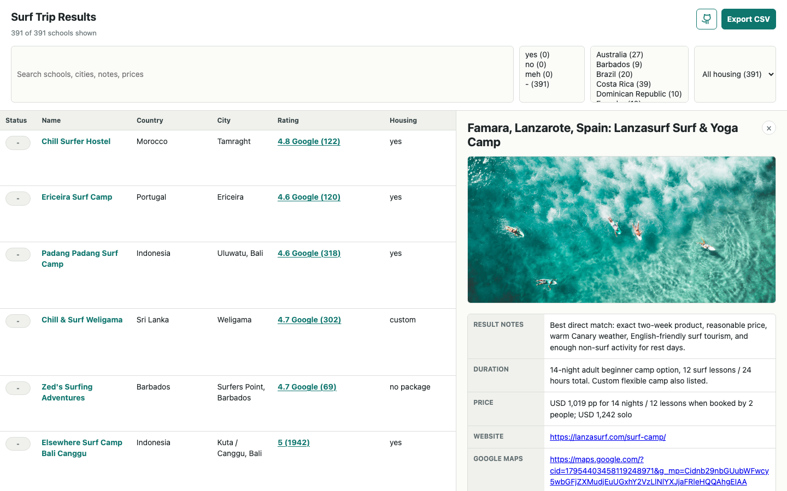

# Travel Surfing Planner

A lightweight local viewer for comparing surf trip options for two complete beginners looking for English-language lessons between September 20 and the end of October 2026.



## Run

```sh
bun install
bun start
```

`bun start` opens the results page in a browser. The UI supports search, sorting, country/status/housing filters, local status labels (`yes`, `no`, `meh`, `-`), CSV export, and a right-side detail panel for each school.

## Data

- `data/result.md` is the main ranked table.
- `data/[country]__[school].md` files hold the detailed school notes.
- Each school detail file starts with `<!-- google_maps_id: ... -->`; that Google Places ID is the canonical dedupe key.
- Known prices are normalized to USD per person when possible. Quote-needed rows stay marked as quote/source confirmation.
- Audit files in `data/` explain the catch-up pass, Google Maps ID stamping, and USD conversion.

## Useful Scripts

```sh
./scripts/google-maps.ts search "beginner surf lessons Ericeira Portugal"
./scripts/stamp-google-maps-ids.ts
./scripts/convert-prices-to-usd.ts
```
